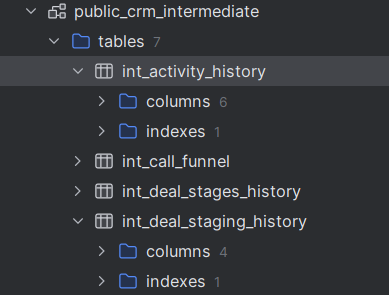
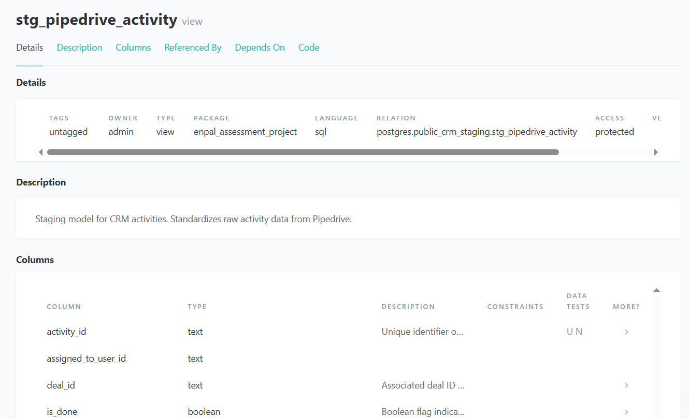
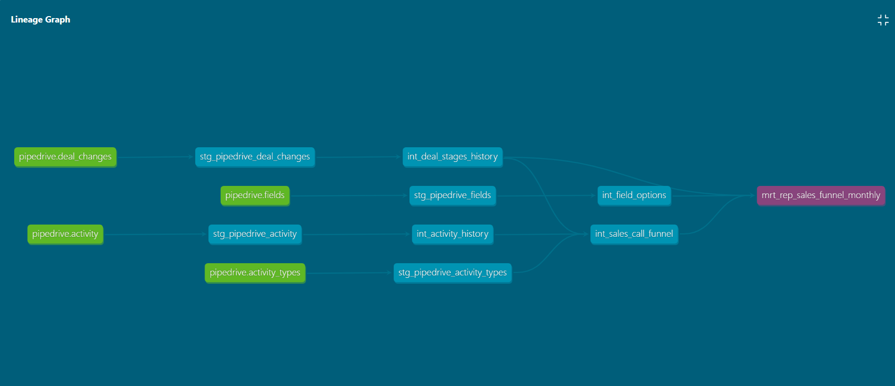

# CRM Analytics Data Models

## Overview

This project builds a **scalable and maintainable CRM analytics foundation** using dbt.
It transforms raw CRM data into **clean, well-documented, and analysis-ready datasets**.

Key design principles:

* Domain-oriented structure (`crm`)
* Three-layer modeling: **staging → intermediate → mart**
* Centralized documentation and tests for reusability

---

## Project Structure

```
models/
  crm/
    staging/        # Source-aligned, light transformations (views)
    intermediate/   # Business logic, history tables (tables)
    mart/           # Reporting-ready datasets (tables)
  documentation/
    documentation_crm.md
```

### Layer Details

* **Staging (`crm_staging`)**

  * 1:1 with sources, light transformations (renaming, typing)
  * Implemented as **views** → avoids duplication, ensures freshness

* **Intermediate (`crm_intermediate`)**

  * Complex business logic, joins, transformations
  * Implemented as **tables** → optimized for downstream queries

* **Mart (`crm_marts`)**

  * Reporting-ready datasets for analysts
  * Implemented as **tables** → performance and stability

---

## dbt Configuration

```yaml
crm:
  staging:
    +schema: crm_staging
    +materialized: view
  intermediate:
    +schema: crm_intermediate
  mart:
    +schema: crm_marts
    +materialized: table
```

* Ensures each layer is placed in the correct schema
* Default materializations enforce consistency
* Supports **clear separation of concerns** and maintainability

---

## Documentation & Testing

* Centralized column descriptions in `models/documentation/documentation_crm.md`
* Each layer has a YAML file with:
  * Models description
  * Columns description (referencing centralized doc)
  * Tests: `not_null`, `unique`
* Ensures **consistency, collaboration, and governance**

---

## Incremental Models

Two key history tables use **incremental loading**:

* `int_activity_history`
* `int_deal_staging_history`

Features:

* `incremental_strategy='append'` for the int_deal_stages_history because every change will generate a new row 
* `incremental_strategy='merge'` → for the int_activity_history to handle late-arriving data efficiently
* Filter recent records to reduce scan volume:

```sql

  WHERE due_to_at >= current_date - interval '{{ lookback_days }} day'

```

* Manual indexes added to improve query performance (e.g., `(deal_id, stage_started_at)`)
```sql
CREATE INDEX IF NOT EXISTS idx_deal_stage_history
   ON public_crm_intermediate.int_deal_stages_history (deal_id, stage_started_at);
```

---

## Models Implemented
```sql
SELECT table_schema, table_name, table_type
FROM postgres.information_schema.tables
WHERE table_schema LIKE 'public_crm%'
ORDER BY table_schema, table_name
```
### Staging (views)

* `stg_pipedrive_activity`
* `stg_pipedrive_activity_types`
* `stg_pipedrive_deal_changes`
* `stg_pipedrive_fields`
* `stg_pipedrive_stages`
* `stg_pipedrive_users`

### Intermediate (tables)

* `int_activity_history`
* `int_call_funnel`
* `int_deal_stages_history`
* `int_field_options`
* `int_sales_call_funnel`
* `int_unpivot_fields`

### Mart (tables)

* `mrt_rep_sales_funnel_monthly`

## dbt Documentation & Lineage
By running the following commands:
- dbt docs generate
- dbt docs serve

you can view the full documentation, tests, and model lineage in an interactive interface.

This allows to:
- Explore each model and its column descriptions
- See test coverage for each column
- Visualize the dependency graph and how data flows from sources → staging → intermediate → marts



## Future Improvements

* Create a **snapshot table** with the latest deal stage for faster access
* **Mask PII** in the `users` table for compliance (GDPR)

---

## Key Benefits

* **Maintainability** → clear layer separation, domain-oriented structure
* **Performance** → incremental models and indexes
* **Collaboration** → centralized docs and tests
* **Scalability** → ready to extend for additional domains (finance, marketing, etc.)
